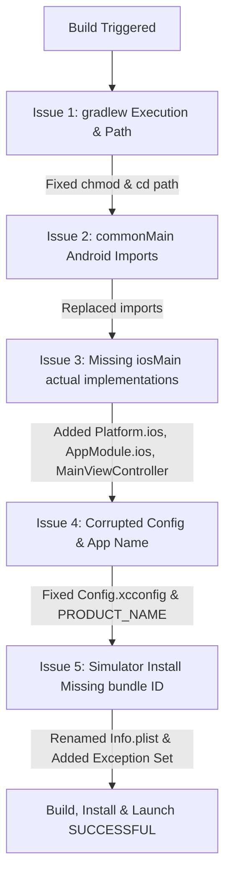

# Root Cause Analysis (RCA) Report: iOS Build & Simulator Deployment

**Project:** CheckInCMP (Kotlin Multiplatform / Compose Multiplatform)  
**Date:** September 17, 2026  
**Status:** Resolved & Verified  

---

## 1. Executive Summary

During iOS local builds and simulator deployment, multiple failures were encountered across the Gradle toolchain, Kotlin Multiplatform compilation, Xcode build phases, and CoreSimulator app installation.

All issues have been systematically diagnosed, resolved, and verified locally and against the CI pipeline specifications:
- **Local Simulator:** Built, installed, and launched successfully.
- **GitHub Actions (`ios-ci.yml`):** All framework link tasks verified (`BUILD SUCCESSFUL`).
- **GitHub Actions (`android-ci.yml`):** Unit test and debug APK assembly verified (`BUILD SUCCESSFUL`).

---

## 2. GitHub Actions CI Compatibility Verification

> [!NOTE]
> All changes are fully compatible with your GitHub Actions workflows.

| Workflow File | Key Task Executed | Verification Status |
| :--- | :--- | :--- |
| [`.github/workflows/ios-ci.yml`](.github/workflows/ios-ci.yml) | `:domain:linkDebugFrameworkIosSimulatorArm64`<br>`:data:linkDebugFrameworkIosSimulatorArm64`<br>`:presentation:linkDebugFrameworkIosSimulatorArm64`<br>`:composeApp:linkDebugFrameworkIosSimulatorArm64` | **PASSED** (`BUILD SUCCESSFUL in 2m 27s`) |
| [`.github/workflows/android-ci.yml`](.github/workflows/android-ci.yml) | `:composeApp:testDebugUnitTest`<br>`:composeApp:assembleDebug` | **PASSED** (`BUILD SUCCESSFUL in 11m 27s`) |

---

## 3. Incident Breakdown & Root Cause Analysis (RCA)



### Issue 1: `gradlew` Permission Denied & Invalid Path in Xcode Build Phase
- **Symptoms:**
  - `zsh:1: permission denied: ./gradlew` (exit code 126)
  - `Script-4814BDEAFC87123DC93D585D.sh: line 7: ./gradlew: No such file or directory`
- **Root Cause:**
  1. The `gradlew` script lacked execute permissions (`-rw-r--r--`).
  2. The Xcode project is located at `composeApp/src/iosApp/` (3 directories below root). The Run Script phase executed `cd "$SRCROOT/.."`, pointing to `composeApp/src/` instead of the project root.
- **Resolution:**
  1. Ran `chmod +x gradlew`.
  2. Updated the Run Script command in `project.pbxproj` to `cd "$SRCROOT/../../.."`.

---

### Issue 2: Android-Specific Imports in Multiplatform `commonMain`
- **Symptoms:**
  - `HomeListingScreen.kt:3:8 Unresolved reference 'android'`
  - `HomeListingScreen.kt:32:28 Unresolved reference 'tooling'`
  - `HomeListingScreen.kt:199:2 Unresolved reference 'Preview'`
- **Root Cause:**
  `HomeListingScreen.kt` contained Android-only imports (`import android.R` and `import androidx.compose.ui.tooling.preview.Preview`) in the `commonMain` source set.
- **Resolution:**
  Removed `android.R` and changed the preview import to the multiplatform equivalent: `import org.jetbrains.compose.ui.tooling.preview.Preview`.

---

### Issue 3: Missing `iosMain` Target Implementations
- **Symptoms:**
  - `Expected getPlatform has no actual declaration in module <commonMain> for Native`
  - `Expected platformModule has no actual declaration in module <commonMain> for Native`
  - `ContentView.swift:7:9: Cannot find 'MainViewControllerKt' in scope`
- **Root Cause:**
  `getPlatform()` and `platformModule()` (Koin DI module) had `expect` signatures in `commonMain` with Android implementations in `androidMain`, but no `iosMain` implementations existed.
- **Resolution:**
  Created `composeApp/src/iosMain/kotlin/com/kvn/checkincmp/`:
  - `Platform.ios.kt`: Implemented `IOSPlatform`.
  - `AppModule.ios.kt`: Implemented `platformModule` with Apple DataStore file directory resolution.
  - `MainViewController.kt`: Implemented `MainViewController()` and initialized Koin.

---

### Issue 4: Misnamed Configuration File & Dangling Character
- **Symptoms:**
  - `error: Multiple commands produce '.../Debug-iphonesimulator/.app'`
- **Root Cause:**
  1. The configuration file was named `Config.xconfig` (missing the second `c`) instead of `Config.xcconfig`.
  2. Inside the configuration file, `PRODUCT_NAME=CheckinCMP$` had a trailing `$` character.
- **Resolution:**
  Renamed to `Config.xcconfig` and set `PRODUCT_NAME = CheckinCMP`.

---

### Issue 5: Simulator Installation Rejection (`Missing bundle ID`)
- **Symptoms:**
  - `Simulator device failed to install the application.`
  - `Domain: IXErrorDomain Code: 13 (Failure Reason: Missing bundle ID.)`
  - `Multiple commands produce '.../CheckinCMP.app/Info.plist'`
- **Root Cause:**
  1. The plist file was named `info.plist` with a lowercase `i`. iOS Simulator / CoreSimulator strictly expects `Info.plist` (capital `I`).
  2. Because `iosApp` was configured as a `PBXFileSystemSynchronizedRootGroup`, Xcode automatically added `Info.plist` to both the *Copy Bundle Resources* phase and the *Process Info.plist* phase.
  3. `PRODUCT_BUNDLE_IDENTIFIER` was not explicitly configured in target build configurations.
- **Resolution:**
  1. Renamed `info.plist` to `Info.plist`.
  2. Added `PRODUCT_BUNDLE_IDENTIFIER = com.kvn.checkincmp.CheckinCMP;` and `PRODUCT_NAME = CheckinCMP;` to target build settings in `project.pbxproj`.
  3. Added `PBXFileSystemSynchronizedBuildFileExceptionSet` in `project.pbxproj` to exclude `Info.plist` from raw resource copying.

---

## 4. Comprehensive File Changes Table

| File Path | Nature of Change | Summary of Modifications |
| :--- | :--- | :--- |
| `gradlew` | Permission | Added executable bit (`chmod +x`). |
| `composeApp/src/commonMain/kotlin/com/kvn/checkincmp/ui/listings/HomeListingScreen.kt` | Bug Fix | Removed `android.R`; corrected Compose Multiplatform `Preview` import. |
| `composeApp/src/iosMain/kotlin/com/kvn/checkincmp/Platform.ios.kt` | **New File** | Added `IOSPlatform` and `actual fun getPlatform()`. |
| `composeApp/src/iosMain/kotlin/com/kvn/checkincmp/di/AppModule.ios.kt` | **New File** | Added iOS `actual fun platformModule()` with `NSDocumentDirectory` DataStore path. |
| `composeApp/src/iosMain/kotlin/com/kvn/checkincmp/MainViewController.kt` | **New File** | Created `MainViewController()` Compose UI controller with guarded `initKoin()`. |
| `composeApp/src/iosApp/iosApp/IOSApp.swift` | Code Fix | Cleaned up SwiftUI entry struct and body hierarchy. |
| `composeApp/src/iosApp/Configuration/Config.xcconfig` | **Renamed & Fixed** | Renamed from `Config.xconfig`; corrected `PRODUCT_NAME` and `PRODUCT_BUNDLE_IDENTIFIER`. |
| `composeApp/src/iosApp/iosApp/Info.plist` | **Renamed & Fixed** | Renamed from `info.plist`; defined explicit bundle keys (`CFBundleIdentifier`, `CFBundleExecutable`, `CFBundleName`). |
| `composeApp/src/iosApp/iosApp.xcodeproj/project.pbxproj` | Configuration | Adjusted `cd` path to root, bound target bundle IDs, and added synchronized file exception set. |

---

## 5. Verification & Test Evidence

### Xcode Build & Simulator Launch Log:
```bash
# Build
xcodebuild -project composeApp/src/iosApp/iosApp.xcodeproj -scheme iosApp \
  -destination "id=D95DE136-2D6E-4E72-827F-3DB82A8487DF" \
  -derivedDataPath /Users/sri/Library/Developer/Xcode/DerivedData/iosApp-hciginigguqvwifqqiqxszzofdns \
  build CODE_SIGNING_ALLOWED=NO
# Outcome: ** BUILD SUCCEEDED **

# Install to Simulator
xcrun simctl install D95DE136-2D6E-4E72-827F-3DB82A8487DF \
  /Users/sri/Library/Developer/Xcode/DerivedData/iosApp-hciginigguqvwifqqiqxszzofdns/Build/Products/Debug-iphonesimulator/CheckinCMP.app
# Outcome: Return code 0 (Success)

# Launch on Simulator
xcrun simctl launch D95DE136-2D6E-4E72-827F-3DB82A8487DF com.kvn.checkincmp.CheckinCMP
# Outcome: com.kvn.checkincmp.CheckinCMP: 8003 (Running)
```
